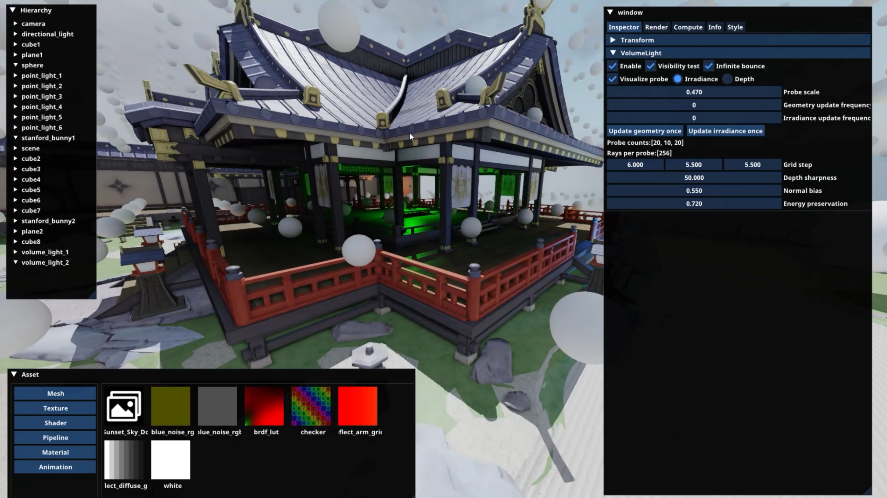
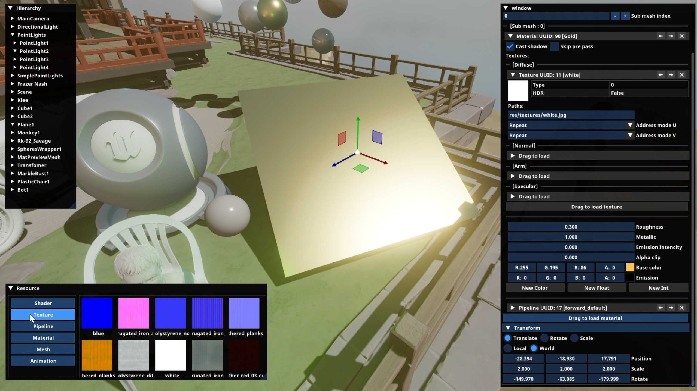

# Bob's Toy Renderer

## 关于此仓库
本仓库是由我学习图形学过程中开发的一个玩具渲染器重构而来。由于旧渲染器代码已较为臃肿且存在一些设计问题，因此计划从头重构整个项目。旧渲染器的功能展示视频在[这里](https://www.bilibili.com/video/BV1EWGJeGEcS/)。  

**目前仓库并未完成全部功能及算法的迁移，cpp端仅包含基础的绘制框架。所有glsl着色器代码已经开放。**  

与渲染相关的主要目录及功能如下：
|  目录   | 功能描述  |
|  ----  | ----  |
| resource/build_in/shader/legacy/  | 旧渲染器的全部着色器代码。实现的功能包括GPU-Driven, DDGI, SSSR, Volumetric Fog等。 |
| resource/build_in/shader/test/  | 测试示例的着色器代码 |
| src/Runtime/Function/Render/RHI/  | 基本的RHI实现, 封装了Vulkan后端，暂未支持光追 |
| src/Runtime/Function/Render/RDG/  | 基本的RDG实现 |
| src/Runtime/Function/Render/RenderResource/  | 上层绘制资源封装及Bindless管理 |
| src/Test/  | 各个功能模块的测试函数, <br>TestRHI.h中包括了使用RHI进行前向渲染的示例, <br>TestRDG.h中包括了使用RDG进行延迟渲染的示例 |

仓库的其他部分也包含了HAL抽象，资源系统，Component-Entity-Scene等功能的简单实现。

## 构建
本仓库使用xmake作为构建工具。目前HAL抽象仅实现了windows平台，RHI仅支持Vulkan后端。

```shell
git clone https://github.com/CPJ-BO/ToyRenderer.git
cd ToyRenderer/renderer
xmake build renderer
xmake run renderer
```

## 参考链接
本仓库的学习和开发过程参考了许多优秀的开源仓库，十分感谢各位大佬的无私分享。

https://github.com/SakuraEngine/SakuraEngine  
https://github.com/google/filament  
https://github.com/EpicGames/UnrealEngine  
https://github.com/BoomingTech/Piccolo  
https://github.com/jjiangweilan/WeilanEngine  
https://github.com/Code-Guy/Bamboo  
https://github.com/flwmxd/LuxGI  
https://github.com/diharaw/hybrid-rendering  
https://github.com/liameitimie/learn-nanite  
https://github.com/KhronosGroup/Vulkan-Samples  


## 截图


